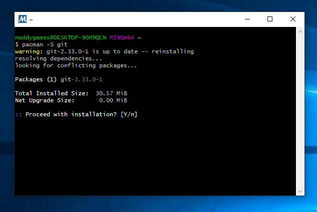

# README #
This project is a **Makefile** starter kit

## What is this repository for? ##
* Getting started with Visual Studio Code and Makefiles
### How do I get set up? ###
* Download Visual Studio Code
* Install C/C++ for Visual Studio Code
> `ctrl+shift+x`
search for `@ext:ms-vscode.cpptools` or `C/C++ IntelliSense, debugging, and code browsing.`
Install this plugin,
* Ensure build tools are installed one linux run terminal command `sudo apt install build-essential gdb`. This installs essential build tools and gdb debugger. For Windows see [Using GCC with MinGW](https://code.visualstudio.com/docs/cpp/config-mingw).
* Create Makefiles and Source (see Parts 1 to 10 below for introduction to **make**)
* Try out various Makefiles and Makefile syntax

## Configuration guidelines ##
* Ensure Visual Studio Code is setup correcly. A typical error is that 'Tab's is set to spaces instead of being stored as tabs.
* Makefile should be indented using tabs, if you receive an error message similar to this `Makefile:2: *** missing separator. Stop.` check your VSC tabs settings
* Stackoverflow has entry on this specific error message [Stackoverflow](https://stackoverflow.com/questions/23927212/makefile2-missing-separator-stop).
*  [Makefile execution success](./images/MakeFileSuccess.png)

### Part 1 
Use the sample *`makefile`* below to verify that ***make*** is setup correctly. If will also confirm that ***Bash*** terminal within VSC is setup correctly. The space before `echo` should be a tab. The file should be saved with filename `Makefile` or `makefile`. Type `make` command into terminal to invoke make.

>
```
hello:
	echo "Checking that tabs are setup correctly
```

### Part 2 
 Type the following code into terminal
>`g++ -o sampleapp ./src/main.cpp ./src/sample_function.cpp -I.`

* **g++** is the compiler command. This command invokes the C++ compiler from the **GNU Compiler Collection (GCC)**
* **-o** compiles and links and generates an executable target from the compiled objects
* **sampleapp** target filename of binary or executable
* **./src/main.cpp** is name and location of 'mainline' main file
* **./src/sample_function.cpp** is a dependency
* **-I.** loads library during the object code link phase, in this case our header file (note `.` at the end, which specifies current path/directory)

>**NOTE:** will expand on these commands with in makefile in the parts that follow.

### Part 3
Type the following code into terminal to produce object files
>`g++ -c ./src/main.cpp ./src/sample_function.cpp -I.`

Open files ending in **.o** and review their contents

### Part 4
Type the following code into terminal to produce assembly files
>`g++ -S ./src/main.cpp ./src/sample_function.cpp -I.`

Open files ending in **.s** and review their contents

### Part 5 
Hitting the **Wall**

Include the -Wall option. This will ensure all warning messages that are generated during compilation will be printed out

>`g++ -Wall -o ./src/main.cpp ./src/sample_function.cpp -I.`

### Part 6
Putting in a make file
Need a build taget label and tab for recipe

>
```
build:
    g++ -o sampleapp ./src/main.cpp ./src/sample_function.cpp -I.
```

### Part 7
Adding progress output

>
```
build:
    @echo "Build Started"
    g++ -o sampleapp ./src/main.cpp ./src/sample_function.cpp -I.
    @echo "Build Complete"
```

### Part 8
Replacing the default goal for make

`.DEFAULT_GOAL:= build` or default target `all:`

[](https://mermaid-js.github.io/mermaid-live-editor/edit#eyJjb2RlIjoiZ3JhcGggVEQ7XG4gICAgQVthbGw6XSAtLSBDYWxscyBUYXJnZXQgLS0-IEJbYnVpbGQ6XVxuICAiLCJtZXJtYWlkIjoie1xuICBcInRoZW1lXCI6IFwiZGVmYXVsdFwiXG59IiwidXBkYXRlRWRpdG9yIjpmYWxzZSwiYXV0b1N5bmMiOnRydWUsInVwZGF0ZURpYWdyYW0iOmZhbHNlfQ)

### Part 9
Cleaning up by removing intermediate files (object files)
>
```
clean:
	@echo "Cleaning up"
	rm *.o
```

Call by typing `make clean` in terminal

### Part 10
Completed simple Makefile
>
```
all:= build

build:
	@echo "Build Started"
	g++ -o sampleapp ./src/main.cpp ./src/sample_function.cpp -I.
	@echo "Build Complete"
	./sampleapp

clean:
	@echo "Cleaning up"
	rm *.o
```

### Part 11
Explore adding variables, compiler and linker options
>
```
CXX			:= g++

MSG_START	:= "Build Started"
MSG_END		:= "Build Complete"
MSG_CLEAN	:= "Cleaning up"

BUILD_DIR	:= ./bin
SRC_DIR		:= ./src

TARGET		:= ${BUILD_DIR}/sampleapp.bin

SRC			:= ${SRC_DIR}/main.cpp ${SRC_DIR}/sample_function.cpp

all			:= build

build:
	@echo ${MSG_START}
	${CXX} -o ${TARGET} ${SRC} -I.
	@echo ${MSG_END}
	./${TARGET}

clean:
	@echo ${MSG_CLEAN}
	rm ${TARGET}
```

>**NOTE**
`-g provides debugging feature when using gdb`
`-Wextra -Werror` enables some extra warnings not turned on by -Wall. -Werror make all warnings into errors ;-)
`:=` operator is a simply expanded variable, avoid recursive assignment and potential recursive calls in makefiles.

```
CXX = g++
CXX = ${CXX}

all:
    @echo ${CXX}
```
>**NOTE** Try the above code to see a recursive call to CXX

## Setting Up Build Tools with Msys64 on Windows ##

### Get familiar with ***Bash*** commands
* If you already have GitBash installed tryout the following terminal commands
* `pwd' Present working directory
* `ls` list the contents of a directory
* `cd` change directory
* `mkdir` make directory


### Download Msys
* Download Msys from [https://www.msys2.org/](https://www.msys2.org/)
> ***NOTE*** Msys is a helpful installer that uses a package manager called `pacman'. [Pacman](https://www.msys2.org/docs/package-management/) is used in ***Arch Linux*** for package management.

* Run the Msys terminal and Update pacman
* Update the package database and base packages type `pacman -Syu`
* Run "MSYS2 MSYS" and update the rest of the base packages with `pacman -Su`
* Install ***git***, open "MSYS2 MSYS" terminal and type `pacman -S git`

* Install ***make***, open "MSYS2 MSYS" terminal and type`pacman -S make`

* Open "MSYS2 MSYS" terminal and type `pacman -S mingw-w64-x86_64-gcc` to install gcc / g++
* To install GDB Open "MSYS2 MSYS" terminal and type `pacman -S mingw-w64-x86_64-gdb`
* Open "MSYS 64" and type `g++` to check g++ is installed. Type `gdb` to check that gdb is installed.
* Modify system path to include path to mingw64 `C:\msys64\mingw64\bin`
* Open up a command prompt and type `g++ --version` to check g++ is installed. Type `gdb --version` to check that gdb is installed.

> ***Note*** modify Terminal Settings in VSC to enable MSYS Bash Terminal
```
{
     "terminal.integrated.shell.windows": "C:\\msys64\\usr\\bin\\bash.exe", 
     "terminal.integrated.shellArgs.windows": ["--login", "-i"],
     "terminal.integrated.env.windows": { 
          "MSYSTEM": "MINGW64", 
          "CHERE_INVOKING":"1" } 
}
```

## Useful Resources ##
* [GNU Make Manual](http://www.gnu.org/software/make/manual/make.html)
* [Makefile Tutorial](https://makefiletutorial.com/)
* [GDB GNU Debugger Project](https://www.gnu.org/software/gdb/)
* [Enabling build and debugging in Visual Studio Code](https://dev.to/talhabalaj/setup-visual-studio-code-for-multi-file-c-projects-1jpi)
* Debugging with VSC beyond return point may result in the following error message being displayed [pop up](https://github.com/Microsoft/vscode-cpptools/issues/1123)

## Who do I talk to? ##
* philip.bourke@itcarlow.ie